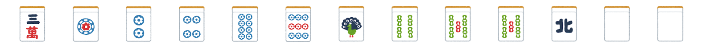

# 一人麻雀について

## 麻雀の基本的なルールについて

- 手持ちの牌は13枚
- 山から1枚引き、不要な牌を捨てる
- これを繰り返し最初にアガった人に得点が入る
- アガるためには14枚目を山から引いた時に、面子（メンツ）を3牌1組で4セット、雀頭（アタマ）を1組そろえる

### 面子とは？

同じ牌3枚または同じ種類の連続した数字の牌3枚

### 雀頭とは？

同じ牌2枚

### テンパイとは？

特定の牌を山から持ってくる（**ツモ**る）か他家が捨てた牌を持ってきたら（**ロン**したら）4面子1雀頭揃う状況のことを**テンパイ**しているといいます。例えば以下の手牌は、次に一番右の牌と同じ牌を持ってきたら4面子1雀頭揃うので、テンパイしていると言えます。

※実戦では4面子1雀頭揃えてもアガリにはならないことがあります。テンパイしているときに**立直（リーチ**）することで、立直という役がつき、その牌を持ってきたときにアガリになります。また、立直以外にも役はありますが、初心者のうちはポンやチーなどはせず、立直に向かうことが大切です。

## 牌効率について

手牌の中でどの牌を切れば一番早く**テンパイ**できるか、という効率のことを**牌効率**といいます。これはいわゆる「何切る」問題を解くことで学ぶことができます。ここではその一例を見てみます。以下の手牌では何を切るのが一番テンパイに近いでしょうか？

## 一人麻雀について

基本的に麻雀はアガリを目指すゲームなのですが、一局でアガれるのは基本一人であり、四人でプレイするゲームなので、どれだけ強い人でもアガり率は25%が関の山です。ただ、アガれない75%の局でも一直線にアガリに向かっていいのかと言うとそうではありません。なぜなら**ロン**されてしまうからです。そこで、「この手牌はアガれない」と思ったらロンされない牌を切っていって守備に回る（オリる）ことが大切です。

一人麻雀では、牌を18巡ツモって、アガれたら+5200点、アガれなかったら-3900点、8巡目まではオリることができて、オリたら-1000点となっています。どういった牌がロンされないか、他家の立直に対して押すのかオリるのか、といった話は長くなるのでここでは説明しませんが、一人麻雀を通して、麻雀の攻撃（牌効率）と守備（オリ）を覚えていただき、麻雀の奥深さの一端に触れてもらえれば幸いです。
